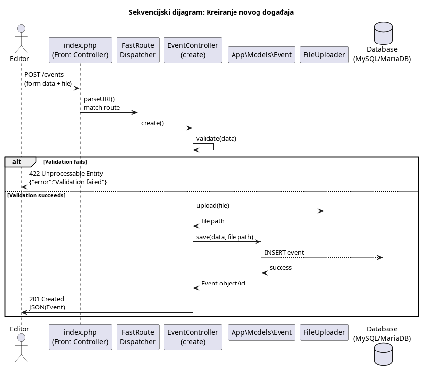
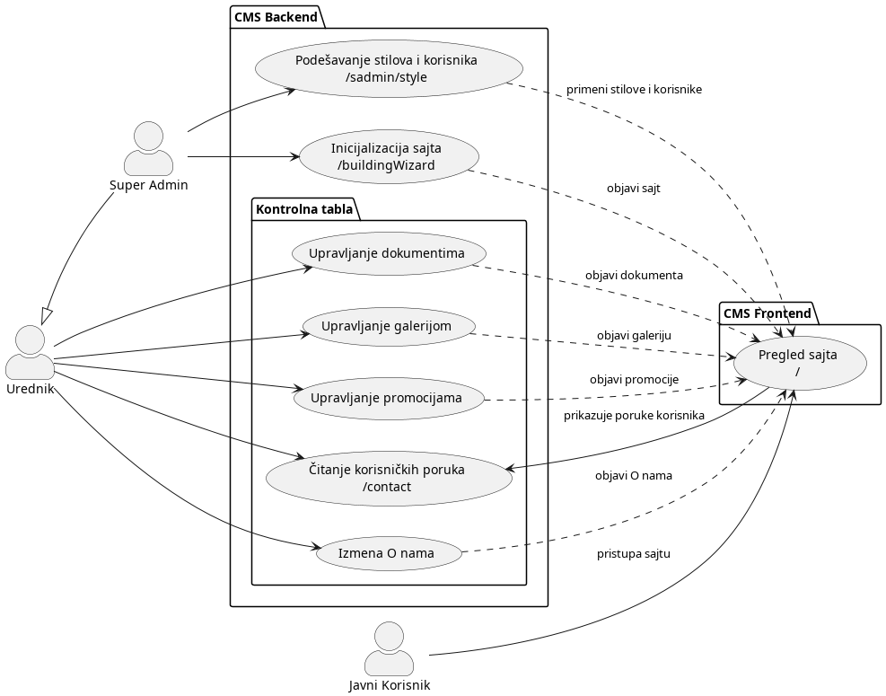

# Instrukcije za pokretanje

1. Kreirati lokalne docker containere:

   ```bash
   make build
   ```

2. Pokrenuti docker containere:

   ```bash
   make up
   ```

3. Kreirati lokalni `.env` file dupliranjem postojećeg `.env.dist`:

   ```bash
   cp project/.env.dist project/.env
   ```

   Po potrebi, izmenite `.env` fajl da odgovara vašim podešavanjima baze

4. Migrirajte bazu podataka:

   - Baza se nalazi u fajlu `cmsrelof_dump.sql`.
   - Logujte se na mysql container sa
      ```bash
      make mysqlsh
      ```
   - Importujte ovu SQL dump datoteku u vašu MySQL bazu podataka, koristeći:

     ```bash
     mysql -u root -p relof3 < cmsrelof_dump.sql
     ```
     Pocetna sifra za mysql server je takodje 'root'


## Arhitektura sistema

Aplikacija je izgrađena po **Front Controller** i **MVC** obrascima: sav HTTP saobraćaj prolazi kroz jedinstveni ulaz (`index.php`), koji pomoću FastRoute rutiranja prosleđuje zahteve generičkim kontrolerima (`App/Controllers/*`). Kontroleri koriste sloj modela (`App/Models/*`) za pristup MySQL/MariaDB, izvršavanje CRUD operacija i poslovnu logiku, dok se pogledi renderuju iz:

- `templates/[naziv]/*.php` (glavni šabloni)
- `exportedPages/*.php` (statistički „izvezeni“ fajlovi ako je sajt inicijalizovan)
- `pages/*.php` (fallback stranice)


## Primer jednog od tokova aplikacije

Tok aktivnosti kreiranja događaja ilustruje:

1. **Aplikacija** šalje `POST /events` [pritisak na dugme] sa formularom i fajlom.
2. **Front Controller** rutira na `EventController::create()`.
3. Validacija podataka; ako ne uspe, vraća se `422`.
4. Fajl se otprema preko `FileUploader`, a model upisuje novi događaj u bazu.
5. Na uspeh, vraća se `201 Created` sa JSON objektom događaja.



# Role korisnika i njihova prava u CMS sistemu



| Uloga              | Opis prava                                                                                                                                      |
| ------------------ | ----------------------------------------------------------------------------------------------------------------------------------------------- |
| **Super Admin**    | - Nasleđuje sva prava Urednika<br>- Inicijalizacija sajta (build wizard)<br>- Podešavanje stilova i korisnika                                   |
| **Urednik**        | - Upravljanje dokumentima<br>- Upravljanje galerijom<br>- Upravljanje promocijama<br>- Čitanje korisničkih poruka<br>- Izmena stranice "O nama" |
| **Javni korisnik** | - Pristup sajtu samo preko frontenda (pregled sadržaja)                                                                                         |

---

**Tok objavljivanja:**

- Sadržaj i podešavanja od strane Super Admina i Urednika se objavljuju i prikazuju na sajtu.
- Javni korisnik pristupa i pregleda objavljeni sadržaj.
- Iz frontend pregleda sajta može se pristupiti čitanju poruka koje šalju korisnici i koje urednici obrađuju.

## ⚙️ Korišćene tehnologije

| Sloj          | Tehnologija         |
| ------------- | ------------------- |
| Frontend      | HTML5, Tailwind CSS |
| Backend       | PHP 8.x             |
| Baza podataka | MySQL               |
| Hosting       | Optimizovano za VPS |

Ove tehnologije su izabrane na osnovu istraživanja uobičajenih IBK hosting okruženja, sa ciljem jednostavne primene i minimalnog opterećenja.

---
